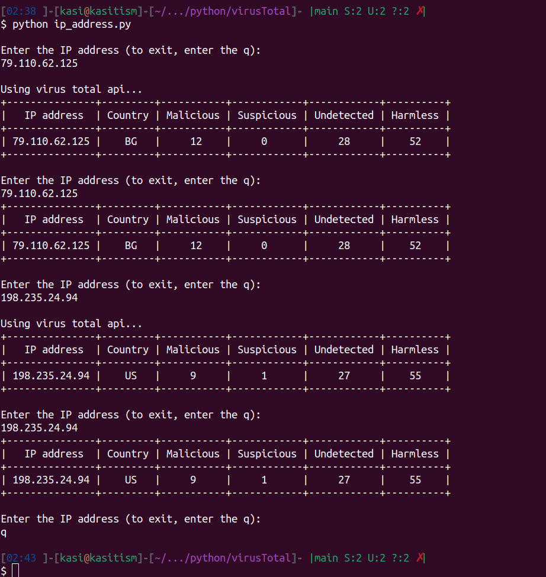

# VirusTotal Project

Firt of all, your IP address will be accessed from the local database. If it is not availabe, it will be taked from the VirusTotal

To start the program, do the following steps:
step 1:
```
    cat <<EOF >> .env
    VT_API_KEY={set your api key from https://www.virustotal.com/}
    MG_USER_NAME=test
    MG_PASSWORD=test
    EOF
```
step 2:
```
    docker compose up -d
```
step 3:
```
    docker compose run ip-address
```
step 5:
> to stop program, 
```
docker compose down

```
>the result should be like the following png.


