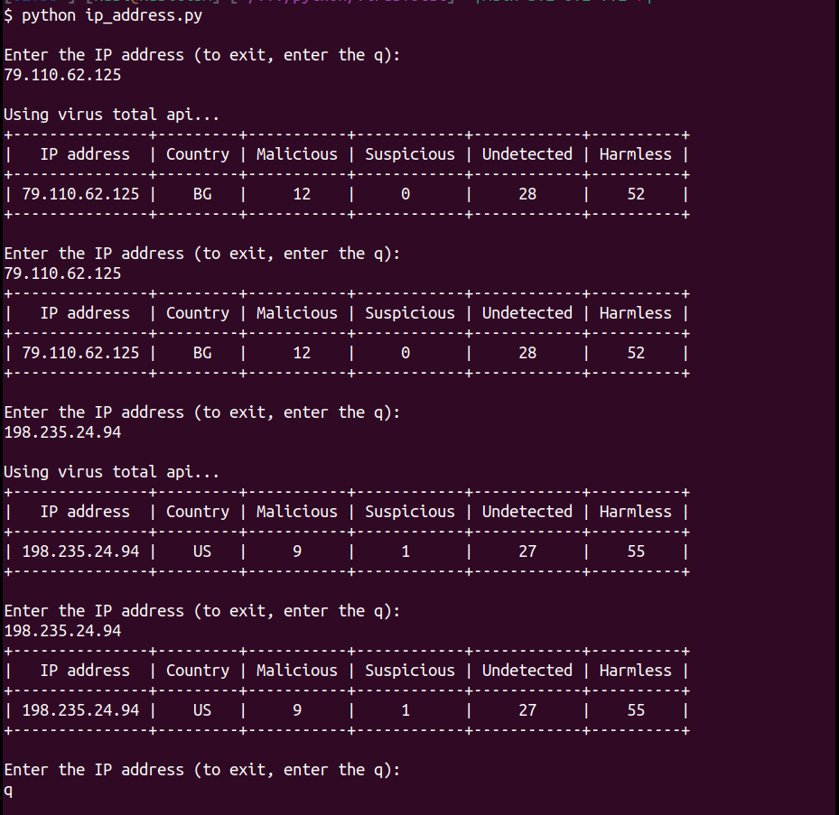

# VirusTotal Project

## 
This is a simple project to check the malicious ip from local mongo db  or virus total api.
First of all, your IP address will be checked from the local database. If it is not availabe, it will be checked from the VirusTotal.
##

To start the program, do the following steps:

step 0:
```
git clone https://github.com/korelor/virusTotal.git
cd virusTotal
```
step 1:
```
cat <<EOF >> .env
VT_API_KEY={set your api key from `https://www.virustotal.com/`}
MG_USER_NAME=test
MG_PASSWORD=test
EOF
sudo mkdir -p /var/mongo/maliciousIPs && sudo chown -R 1004:1004 /var/mongo/maliciousIPs
```
step 2:
```
docker compose up -d
```
step 3:
```
docker compose run ip-address
```
step 5:
> to stop the program, 
```
docker compose down

```
>the result should be like the following png.


